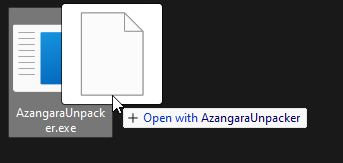

[Русская версия](README.md)

# Dino and Aliens (Nevosoft) .dat Unpacker

|[**Download / Скачать**](https://github.com/zziger/dino-and-aliens-unpacker/releases/latest/download/DinoAndAliensUnpacker.exe)|
|-|

## Usage

- Download latest version [**here**](https://github.com/zziger/dino-and-aliens-unpacker/releases/latest/download/DinoAndAliensUnpacker.exe).
- In order to unpack a .dat file you need to drag and drop it onto the DinoAndAliensUnpacker.exe, folder with unpacked contents will be created next to the .dat file.  
- In order to pack a folder you need to drag and drop it onto the DinoAndAliensUnpacker.exe, example above.
> **Attention!** Folder will be packed into .dat file next to it with the same name as the folder. If such a file already exists, it will be overwritten.

## License

[MIT](LICENSE)

## Contributions

PRs are welcome 
For questions - Discord `zziger#8040`